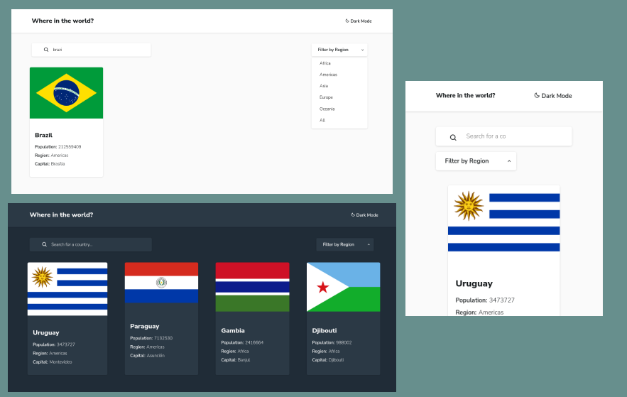

# Frontend Mentor - Rest Countries API 

This is a solution to the Rest Countries API from FrontEndMentor

## Table of contents

- [Overview](#overview)
  - [The challenge](#the-challenge)
  - [Screenshot](#screenshot)
  - [Links](#links)
- [My process](#my-process)
  - [Built with](#built-with)
  - [What I learned](#what-i-learned)
- [Author](#author)

## Overview

### The challenge

Users should be able to:

- View the optimal layout for the site depending on their device's screen size
- See hover states for all interactive elements on the page
- Display the countries pushed from the external API, filter by region or the country name.

### Screenshots

 

### Links

- [Live](https://frontend-rest-countries-api.vercel.app/)

## My process

### Built with

- Semantic HTML5 markup
- CSS3
- Flexbox
- CSS Grid
- Sass preprocessor
- Javascript

### What I learned

One of the most challenge i had, cause i had no idea how to implement a usage of an external API, so i could learn how to fetch a data and display to the page.
